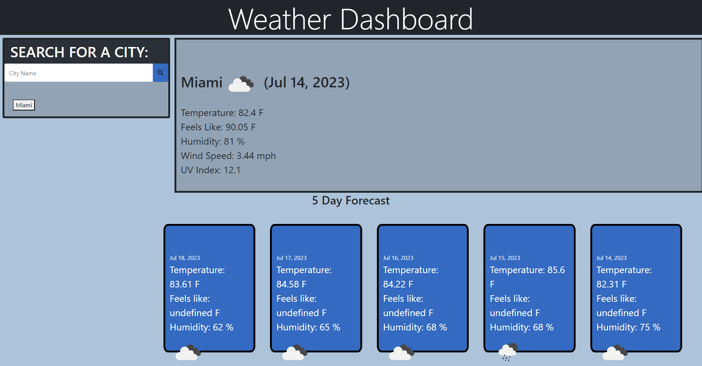

## Cloudy-with-a-Chance-of-Code

## Descritption of my work

The weather dashboard allows travelers to look up the weather for multiple cities so that they can plan their trips accordingly.
When a user searches for a city, they are presented with current and future weather conditions for that city. The city is also added to the search history.
The current weather conditions include the city name, the date, an icon representation of the weather conditions, the temperature, the feels like, the humidity, the wind speed, and the UV index.
The future weather conditions include a 5-day forecast that displays the date, an icon representation of the weather conditions, the temperature, and the humidity.
When a user clicks on a city in the search history, they are again presented with the current and future weather conditions for that city.

## Link to Website -
https://felixfrancisco1776.github.io/Cloudy-with-a-Chance-of-Code/

## Screenshot

